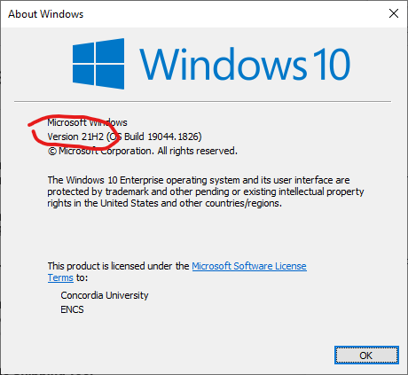

# Setting up NVidia Docker on Windows

## Step 1: Get correct Windows version

Ensure that Windows OS is Windows 10 version 21H2 or higher, or Windows 11.

You can check by looking by using `winver` in the terminal.



## Step 2: Setup WSL

From [https://docs.microsoft.com/en-us/windows/wsl/install](https://docs.microsoft.com/en-us/windows/wsl/install)

In an **administrator** PowerShell or Windows Command Prompt type:

```
wsl --install
```

Then restart the computer.

Go back to a command prompt and type:

```
wsl --set-default-version 2
```

## Step 3: Get Linux (Ubuntu 20.04 LTS)

You can either get it from the Microsoft App Store

or

Type the following into a terminal:

```
wsl --install -d Ubuntu-20.04
```

Check that Ubuntu is running on the correct version of WSL using the following
in cmd:

```
wsl -l -v
```

Ubuntu should have a "2" in the version column

## Step 4: Get Docker

Download and install docker desktop from [https://docs.docker.com/desktop/windows/wsl/](https://docs.docker.com/desktop/windows/wsl/)

Once it is downloaded, go to settings and make sure it WSL integration is set to use Ubuntu.


## Step 5: Setup CUDA

Install the appropriate NVidia drivers and CUDA Toolkit on Windows. And then do the same for Ubuntu.

Follow the steps given at...

[https://docs.nvidia.com/cuda/wsl-user-guide/index.html](https://docs.nvidia.com/cuda/wsl-user-guide/index.html)

or

[https://ubuntu.com/tutorials/enabling-gpu-acceleration-on-ubuntu-on-wsl2-with-the-nvidia-cuda-platform](https://ubuntu.com/tutorials/enabling-gpu-acceleration-on-ubuntu-on-wsl2-with-the-nvidia-cuda-platform)

## Step 6: Test that the GPU is accessible from Ubuntu

In a Windows command prompt type:

```
nvidia-smi
```

And then in the Ubuntu terminal type the same command.

The results should  be the same. If it is then setup is done.

## Step 7: Run the Docker NVidia test.

In a Windows command prompt run the following:

```
docker run --rm -it --gpus=all nvcr.io/nvidia/k8s/cuda-sample:nbody nbody -gpu -benchmark
```

This should also work in an Ubuntu terminal.
